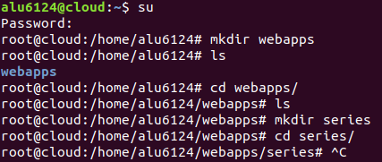
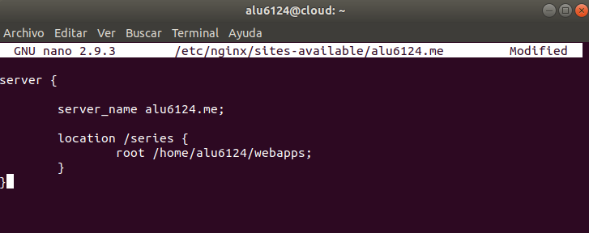
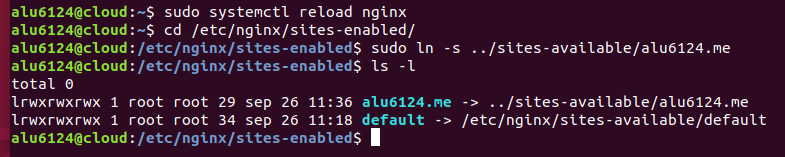
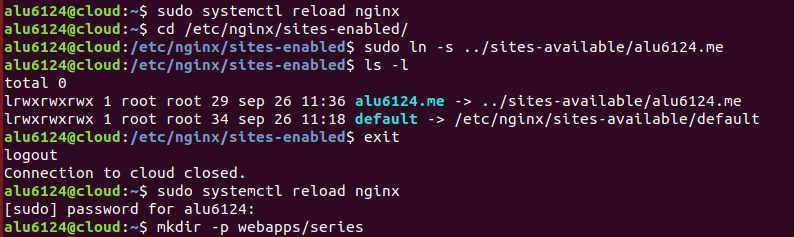
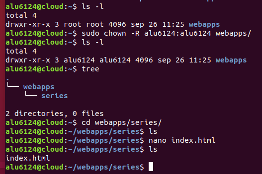
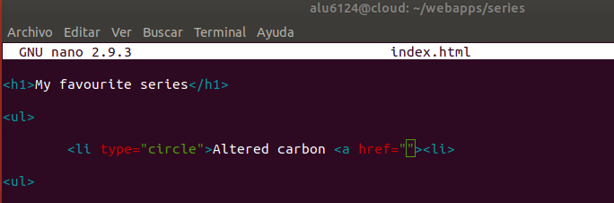
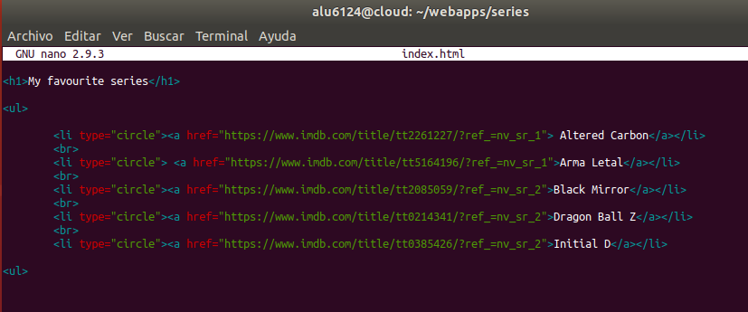
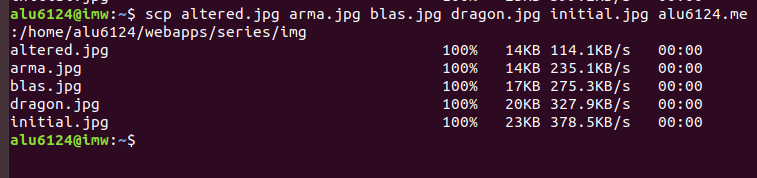
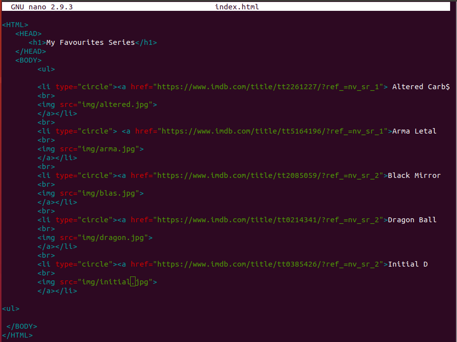

# Mis series favoritas

La actividad consiste en crear una página web que nos enlace a tus 5 series favoritas.

Los requerimientos son los siguientes:

## La página debe abrirse al acceder a http://aluXXXX.me/series/

Accedemos al home del cloud y creamos el directorio webapps y dentro el directorio series, para que la pagina se abra en la ruta requerida.

Debemos acceder al cloud y configurar un location a la carpeta /series en la ruta /etc/nginx/sites-available/alu6421.me apuntando a la ruta root /home/alu6421/webapps

Luego recargamos el servicio y habilitamos el fichero

Aqui ya había creado la carpeta series pero por una confusion contigo profe la volvi a crear en root y le cambiamos los permisos para que estuviera bien

Aquí le cambiamos los permisos a la carpeta y cree el index.html dentro de series.

## index.html

Primera edicion del index.

Añadi las series a una lista junto con los enlaces a IMDB.

Añadi unas imagenes de las series subiendolas desde el remoto al cloud.

Añadi las imagenes al index.html

