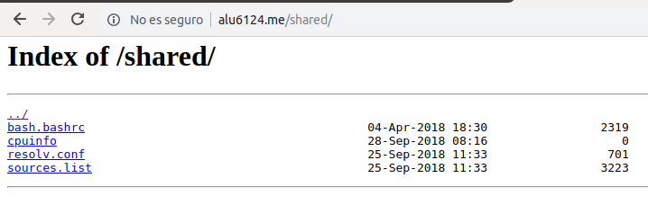

# Listado de Directorios

En esta actividad vamos a permitir el acceso  al contenido de un subdirectorio dentro de la ruta raiz de NGINX, enlazando una serie de ficheros desde ahí:

## Creción de shared

Accedemos al cloud  y dentro de la ruta de webapps creamos la carpeta shared para almacenar los ficheros.

## Creación del location

Accedemos a la ruta /etc/nginx/sites-available/alu6421.me y añadimos el location de **/shared**
y le añadimos **autoindex on**.

## Creción de enlaces simbolicos

Creamos los enlaces simbolicos mediante el comando ln -s y la ruta donde se encuentra el fichero,
comprobamos que se han creado.

Recargamos el nginx y comprobamos los archivos con un ls- l.

## Acceso a la ruta alu6421.me

Accedemos a la ruta alu6421.me para comprobar que la pagina funciona y se muestran los ficheros.

Comprobamos que al hacer click sobre ellos se descargan y funciona.

