# **Trabajos con virtual host**

## En esta actividad vamos a crear 4 Virtual host (sitios web) en el servidor de **Nginx**.

## Sitio web 1

Debemos mostrar una página con la imagen del diagrama de unidades de trabajo, para ello debemos descargar la imagen al directorio de trabajo de la máquina de producción.
Para ello debemos usar un tag  apuntando a la ruta local.

**http://imw.alu6124.me**

Configuramos la página imw.alu6124.me en el archivo de configuración */etc/nginx/sites-available/imw.alu6124.me*

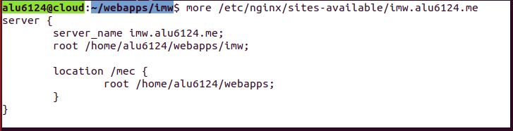

Enlazamos el fichero, para ello accedemos a la ruta */etc/sites-enabled* y con el comando ln -s ../sites-available/imw.alu6124.me, una vez echo esto recargamos el servicio y comprobamos que se ha creado.

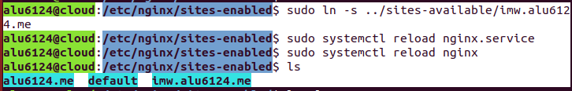

Volvemos a la ruta anterior y cremos la carpeta imw y dentro de ella creamos un index.html.
para obtener la imagen debemos ejecutar el comando wget junto con la ruta de la imagen.

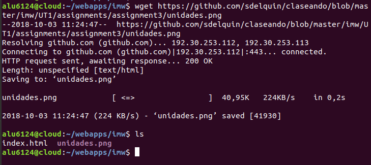

Comprobamos que el index y la imagen se encuentran en la carpeta correctamente.

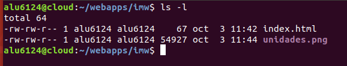

Editamos el index y añadimos un título y el tag para la imagen.

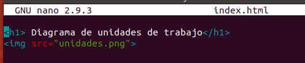

Accedemos a la página para comprobar que funciona.

**http://imw.alu6124.me/mec/**

Añadimos el location a la ruta de mec.

Creamos la carpeta mec y el index.html.

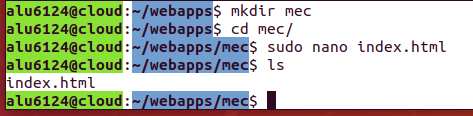

Editamos el index.html, añadimos un título y el enlace al Real decreto del título de Administración de Sistemas Informáticos en Red.

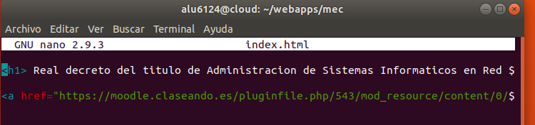

Comprobamos que la pagina funciona y muestra el enlace al Real decreto.

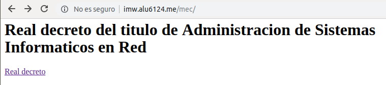

## Sitio web 2

**http://varlib/alu6124.me:9000**

Configuramos la página imw.alu6124.me en el archivo de configuración */etc/nginx/sites-available/varlib.alu6124.me*

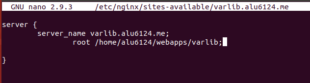

Enlazamos el fichero, para ello accedemos a la ruta */etc/sites-enabled* y con el comando ln -s ../sites-available/varlib.alu6124.me, una vez echo esto recargamos el servicio y comprobamos que se ha creado.

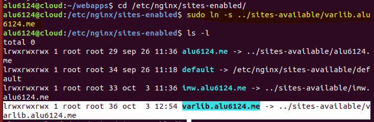

Recargamos el servicio.

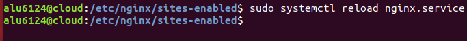

Creamos la carpeta varlib.

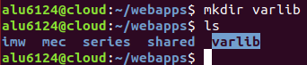

Le añadimos autoindex on, y que escuche el puerto 9000.

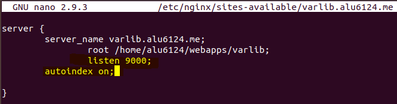

Hacemos el enlace, comprobamos que se ha creado y recargamos el servicio.

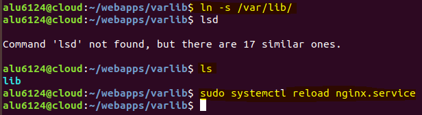

Comprobamos que funciona la web y el enlace

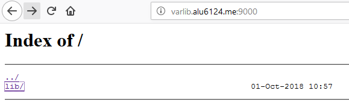

## Sitio web 3

** https://ssl.alu6124.me/students/**

Creamos la carpeta students.

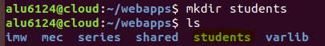

Dentro de la carpeta students ejecutamos el comando perl -le 'print crypt("aula108",'fewsalt')' para que nos encripte la contraseña que va a tener el usuario1, una vez ejecutado nos muestra la contraseña encriptada, luego creamos el fichero .htpasswd y dentro añadimos el nombre del usuario y la contraseña.

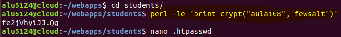

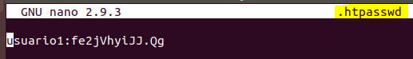
