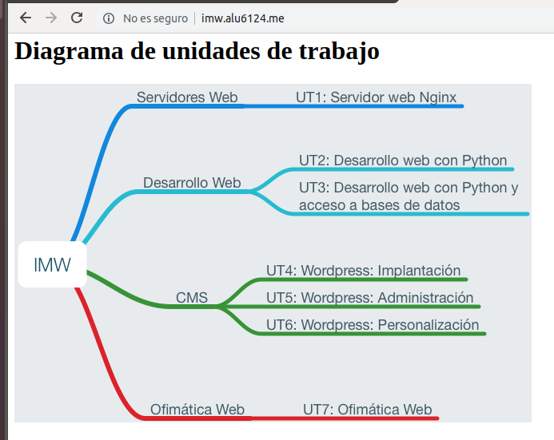
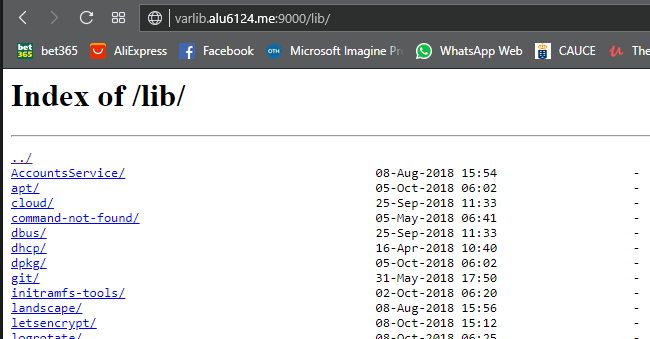
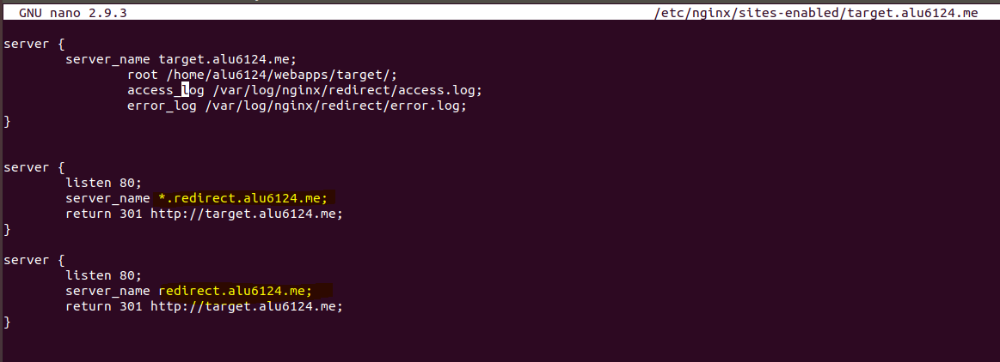
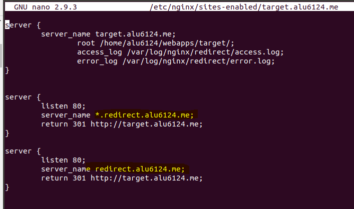

# **Trabajos con virtual host**

## En esta actividad vamos a crear 4 Virtual host (sitios web) en el servidor de **Nginx**.

## Sitio web 1

Debemos mostrar una página con la imagen del diagrama de unidades de trabajo, para ello debemos descargar la imagen al directorio de trabajo de la máquina de producción.
Para ello debemos usar un tag  apuntando a la ruta local.

**http://imw.alu6124.me**

Configuramos la página imw.alu6124.me en el archivo de configuración */etc/nginx/sites-available/imw.alu6124.me*

Enlazamos el fichero, para ello accedemos a la ruta */etc/sites-enabled* y con el comando ln -s ../sites-available/imw.alu6124.me, una vez echo esto recargamos el servicio y comprobamos que se ha creado.

Volvemos a la ruta anterior y cremos la carpeta imw y dentro de ella creamos un index.html.
para obtener la imagen debemos ejecutar el comando wget junto con la ruta de la imagen.

Comprobamos que el index y la imagen se encuentran en la carpeta correctamente.

Editamos el index y añadimos un título y el tag para la imagen.

Accedemos a la página para comprobar que funciona.

**http://imw.alu6124.me/mec/**

Añadimos el location a la ruta de mec.

Creamos la carpeta mec y el index.html.

Editamos el index.html, añadimos un título y el enlace al Real decreto del título de Administración de Sistemas Informáticos en Red.

Comprobamos que la pagina funciona y muestra el enlace al Real decreto.

## Sitio web 2

**http://varlib/alu6124.me:9000**

Configuramos la página imw.alu6124.me en el archivo de configuración */etc/nginx/sites-available/varlib.alu6124.me*

Enlazamos el fichero, para ello accedemos a la ruta */etc/sites-enabled* y con el comando ln -s ../sites-available/varlib.alu6124.me, una vez echo esto recargamos el servicio y comprobamos que se ha creado.

Recargamos el servicio.

Creamos la carpeta varlib.

Le añadimos autoindex on, y que escuche el puerto 9000.

Hacemos el enlace, comprobamos que se ha creado y recargamos el servicio.

Comprobamos que funciona la web y el enlace

## Sitio web 3

**https://ssl.alu6124.me/students/**

Debemos configurar un acceso con **usuario y contraseña** a la web y obtener un certificado **https** y prohibir el acceso al fichero **.htpasswd**.

Configuramos la página ssl.alu6124.me en el archivo de configuración */etc/nginx/sites-available/ssl.alu6124.me* y el location a la ruta.

Enlazamos el fichero y comprobamos que se ha creado.

Reiniciamos el servicio.

Creamos la carpeta students.

Dentro de la carpeta students ejecutamos el comando perl -le 'print crypt("aula108",'fewsalt')' para que nos encripte la contraseña que va a tener el usuario1, una vez ejecutado nos muestra la contraseña encriptada, luego creamos el fichero .htpasswd y dentro añadimos el nombre del usuario y la contraseña.

Añadimos la autenticación al archivo de configuración para que al acceder a la pagina nos pida usuario y clave.

Reiniciamos el servicio y comprobamos que al intentar acceder a la web nos pide que nos identifiquemos.

Ahora debemos denegar el acceso al fichero .htpasswd, para ello vamos al archivo de configuración y añadimos el location para cuando intenten acceder devuelva un error 403 de prohibición.

Accedemos para comprobar que funciona correctamente.

Obtención del certificado de seguridad **https**, para ello debemos ejecutar la herramienta de certbot para la obtención de certificados, una vez ejecutado el comando nos pregunta a que sitio queremos aplicar el certificado, en este caso seleccionamos el número 3 que es la que queremos validar.

Seleccionamos la opción 2 para que redirija a https

Una vez terminado el proceso, recargamos el servicio y comprobamos que disponemos del certificado, para ello comprobamos accediendo a la web y el fichero de configuración.

Editamos el index.html y agregamos una lista con los nombres de los compañeros de clase.

Comprobamos que funciona todo correctamente, al acceder nos pide identificación, el certificado es https, y se muestra la lista.

## Sitio web 4

**http://redirect.alu6124.me**

Debemos redirigir cualquier petición de http://redirect.alu6124.me a http://target.alu6124.me y al acceder a esta mostrar la página web especificada.

Configuramos la página target.alu6124.me en el archivo de configuración */etc/nginx/sites-available/teget.alu6124.me* y las redirecciones las configuramos para que escuchen por el puerto 80 (**http**).

La primera redirección ponemos que todos las busquedas que se realicen con cualquier cosa antes de **redirect.alu6124.me** se redirijan a **target.alu6124.me**, para ello ponemos al principio de la dirección **(*.)**.

La segunda redirección ponemos que cualquier busqueda que incluya **redirect.alu6124.me** se redirija a **target.alu6124.me**

Enlazamos el fichero para que esté disponible y recargamos el servicio.

 Comprobamos que al acceder y añadir **/loquesea** al final del enlace se redirige a **target.alu6124.me**

 
 

 Comprobamos que al acceder y añadir **cualquiercosa**.redirect.alu6124.me redirige a **target.alu6124.me**

 
 

 Ahora creamos la carpeta target y dentro de ella hacemos un **wget** al enlace del zip para obtenerlo y poder mostrar la web.

 

Descomprimimos el zip.

Accedemos a la carpeta y extraemos los ficheros a target.

Extraemos las carpetas a target.

Comprobamos que la web funciona.

Añadimos los logfiles.

Comprobamos que se han creado.

