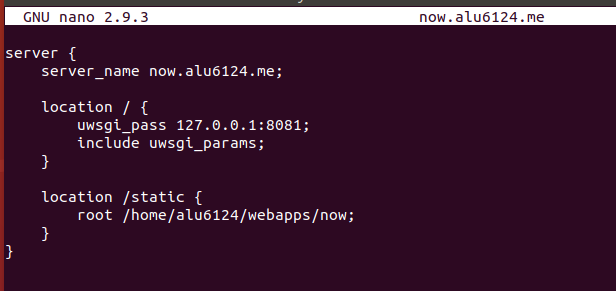

# Sirviendo aplicaciones PHP y Python

## Sito web 1

http://php.alu6124.me

Configuramos la web para que pueda interpretar ficheros .php, para ello creamos el fichero /etc/nginx/sites-available/php.alu6224.me.

Añadimos el location php con esta configuración y declaramos que el autoindex sea .php.

Hacemos el enlace con el comando ln -s ../sites-available/php.alu6124.me.

Ahora nos situamos en la ruta /webapps/php y dentro del directorio hacemos un wget para obtener el zip.

Ejecutamos la herramienta unzip y extraemos los archivos del zip.

Ahora accedemos al directorio que hemos descomprimido y extraemos los archivos al directorio php.

Comprobamos que la web funciona correctamente.

## Sitio web 2

http://now.alu6124.me

Creamos el virtual host para la aplicación Python, ejecutamos el comando */etc/nginx/sites-available/now.alu6124.me.*

Configuramos el fichero tal que así, el puerto que hemos añadido es el *8081* dado que el *8080* ya está en uso.

Enlazamos el virtual host para habilitarlo, accedemos a la ruta /etc/nginx/sites-enabled/ y ejecutamos el comando *ln -s ../sites-available/now.alu6124.me* recargamos nginx y comprobamos.

Accedemos a la ruta */webapps/now* y creamos now.py con el siguiente código.

Lanzamos el proceso *uwsgi --socket :8081 --protocol http --home $(pipenv --venv) -w now:app* para que escuche las peticiones.

Comprobamos que funciona.

