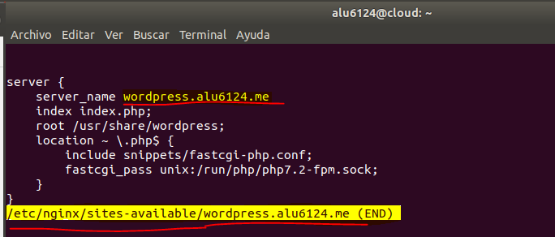
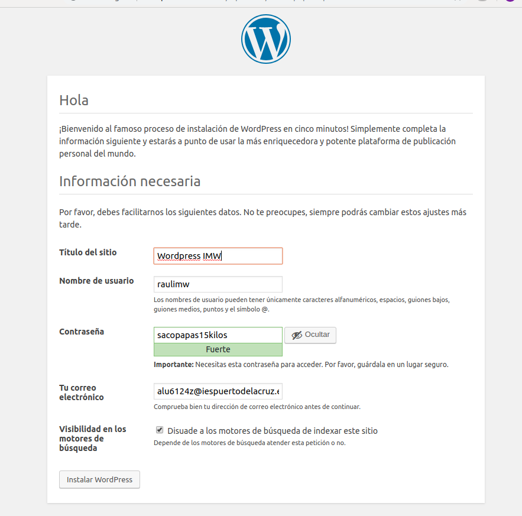

# Instalación de Wordpress
# Vamos a instalar un sitio web Wordpress en nuestra máquina de producción.

### Configuración de la base de datos.
Wordpress necesita credenciales (usuario/contraseña) para acceder a una base de datos. Para ello, usaremos el intérprete de MySQL, **tenemos que crear la base de datos, el usuario y asignar privilegios:**

### Descarga de código
**Descargamos el código fuente de Wordpress desde su página web y descomprimimos el código y lo copiamos en /usr/share:**

Ahora tenemos que establecer los permisos necesarios para que el usuario web www-data pueda usar estos ficheros:

### Editar ficheros de configuración
Para una configuración básica de WordPress debemos especificar lo siguiente:
**El nombre de la base de datos.
El usuario.
La contraseña.**

Para ello copiamos el archivo y lo renombramos antes de modificarlo.

Editamos el fichero una vez realizado el paso anterior.

### Acceso mediante Nginx.
Para que nuestro sitio Wordpress sea accesible desde un navegador web, debemos incluir las directivas necesarias en la configuración del servidor web Nginx.

Creamos un nuevo virtual host.

Enlazamos la configuración para que el virtual host esté disponible:

Recargamos el servidor web Nginx para que los cambios sean efectivos y lo comprobamos.

Una vez instalado comenzamos la configuración de nuestro Wordpress vía web.

Elegimos idioma español y le damos a continuar.

Rellenamos los campos.

Accedemos con nuestras credenciales.

### Ajuste de permalinks
En primer lugar activamos esta opción dentro de la interfaz administrativa de Wordpress:

Seleccionamos el ajuste Día y nombre.

### Ahora debemos indicar a Nginx que procese estas URLs:

### Recargamos la configuración de Nginx:

### Límite de tamaño en la subida de archivos.

Buscamos las siguientes lineas en el codigo php.ini de la ruta /etc/php/7.2/fpm.

### Ahora reinciamos el servicio php-fpm:

### Añadimos una línea en el fichero de configuración de Nginx:

### A continuación reiniciamos el servidor web Nginx para que tengan efectos los cambios realizados en el fichero de configuración:

La estructuras de ficheros ha quedado tal que así.

## WordPress

Ahora elegimos un tema y lo configuramos, además de escribir un post con las estadísticas de wordpress.

