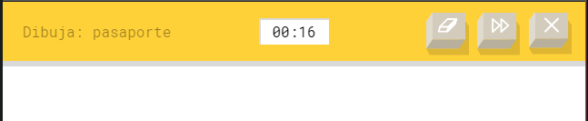
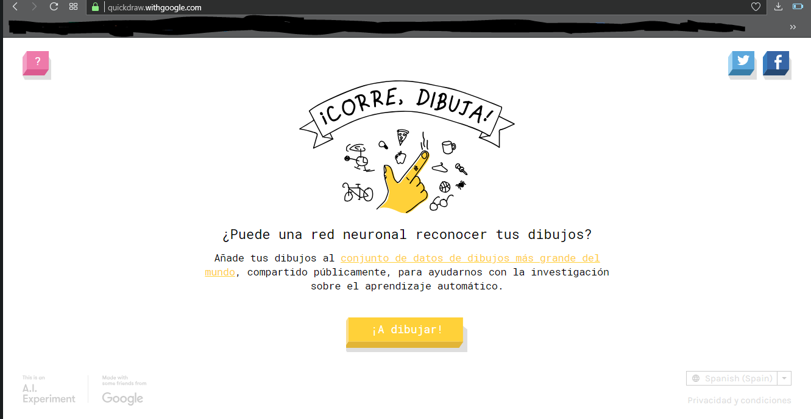
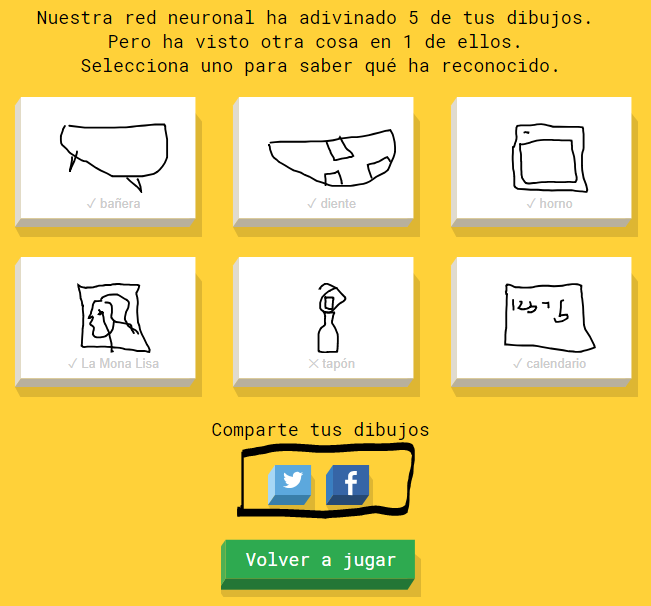
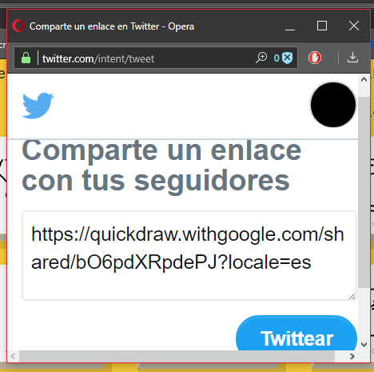

# Ofimática Web

## Google Draw

#### ¿Qué características destacas de la herramienta?

Que la IA te habla mientras intenta adivnar lo que dibujamos y es muy variado su contenido de dibujos.

Nos da un margen de 20 segundos, muestra lo que debemos dibujas, muestra la opción de borrar, pasar a la siguiente o cancelar.

#### Características de la herramienta

Es un juego en el que una red neuronal (IA) va intentando adivinar lo que dibujamos mientras va aprendiendo con los dibujos de la gente y así adivina mas rapido lo que hacemos.

#### ¿Qué funcionalidades echas en falta?

Que permita más segundos para dibujar y que permita mas herramientas para pintar.

#### ¿Qué opciones tiene para compartir/trabajo colaborativo?

Ninguna, es solo una herramienta de uso personal.

#### Opciones de exportación/guardado en local:

Es posible compartirla a través de una URL generada o directamente en Twitter o Facebook.

